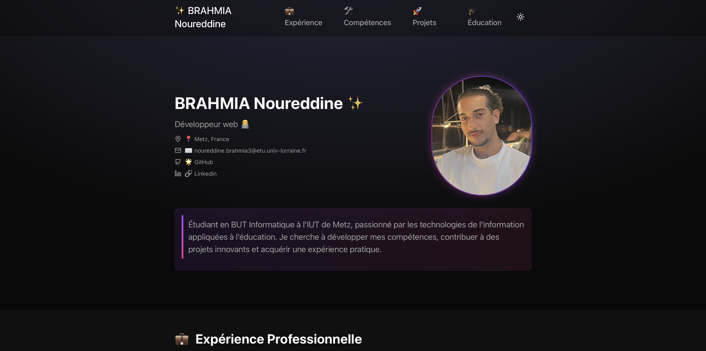

# Portfolio - Brahmia Noureddine

Bienvenue sur mon portfolio personnel ! Ce projet met en avant mes compétences, expériences, projets et réalisations dans le domaine de l'informatique et de l'intelligence artificielle.

## 🚀 Fonctionnalités

- **Présentation des projets** : Découvrez mes projets, notamment "CV Optimizer".
- **Expériences professionnelles** : Parcourez mes expériences dans le domaine.
- **Compétences techniques** : Liste des technologies et outils que je maîtrise.
- **Récompenses et certifications** : Mes distinctions académiques et professionnelles.
- **Éducation** : Mon parcours académique.

## 🛠️ Technologies utilisées

- **Astro** : Framework pour la création de sites statiques.
- **React** : Composants dynamiques et interactifs.
- **Tailwind CSS** : Framework CSS pour un design moderne et réactif.
- **Framer Motion** : Animations fluides et interactives.

## 📸 Aperçu



## 📂 Structure du projet

```
src/
├── components/       # Composants React
├── layouts/          # Layouts Astro
├── lib/              # Données et utilitaires
├── pages/            # Pages du site
├── styles/           # Styles globaux
public/               # Assets publics (images, favicon, etc.)
```

## 🔗 Lien vers le projet

[Portfolio en ligne](https://devnordine.github.io/Portfolio)

## 📝 Installation et exécution

1. Clonez le dépôt :
   ```bash
   git clone https://github.com/devnordine/Portfolio.git
   ```
2. Installez les dépendances :
   ```bash
   npm install
   ```
3. Lancez le serveur de développement :
   ```bash
   npm run dev
   ```

## 🤝 Contribuer

Les contributions sont les bienvenues ! N'hésitez pas à ouvrir une issue ou une pull request.

## 📄 Licence

Ce projet est sous licence MIT. Voir le fichier [LICENSE](LICENSE) pour plus d'informations.
